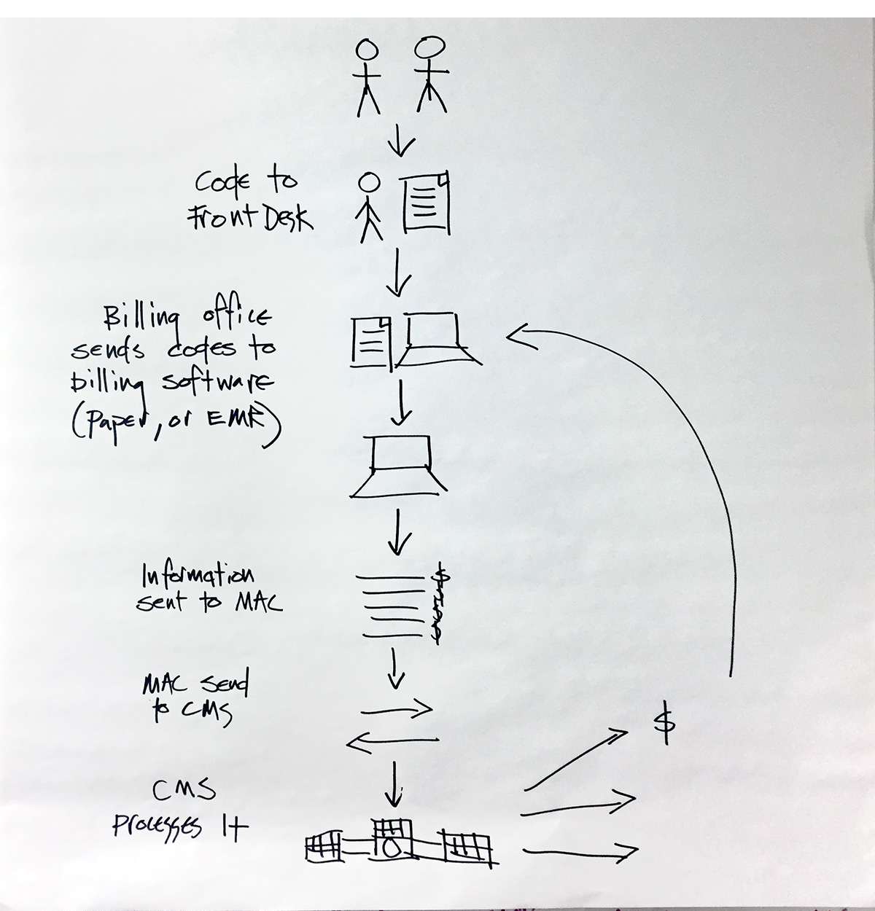

---
# Page template info (DO NOT EDIT)
layout: default
banner_file: banner--people-projects-lg.svg
banner_file_mobile: banner--people-projects-sm.svg
project_page: true

# Carousel (Edit this)
carousel_title: "Modernizing the Medicare Payment System"
carousel_summary: "Eight million lines of COBOL and 2.5 million lines of assembly running on 15 mainframes. Four percent of the entire American economy is fueled by Medicare payments and 57 million people depend on it for their healthcare."
carousel_image_name: project-hhs-payment-mod-card.jpg

# Project detail page (Edit this)
title: "Medicare Payment System Modernization"
agency: Health and Human Services
permalink: projects/medicare-payment-program
project_url: https://www.cms.gov/

# Impact statement (Edit this)
impact_statement:
  - figure: "57"
    unit: "M"
    description: |-
      Americans depend on Medicare payments for their healthcare

  - figure: 10
    unit: "K"
    description: |-
      Additional people enroll in Medicare per day
---

## The Challenge

The system that powers Medicare is 40 years old. It runs on 15 mainframe computers, 8 million lines of COBOL, and 2.5 million lines of assembly language. Four percent of the entire American economy is fueled by Medicare payments and 57 million people depend on it for their healthcare. Every day, 10,000 more people enroll in Medicare and the system is approaching a point where its aging infrastructure will not be able to handle the load. The country cannot afford for this system to fail.

## The Solution

We're partnering with the Centers for Medicare & Medicaid Services to implement an API-first strategy to modernize the Medicare payment system. A new cloud environment offers better scalability and can grow with Medicare over time. This empowers clinicians to seamlessly submit quality metrics to CMS, receive feedback, and payment for their work in minutes, rather than months.

## Press

- [USDS Teams at CMS Spur IT Modernization](https://fedtechmagazine.com/article/2018/06/usds-teams-cms-spur-it-modernization)
- [U.S. Digital Service helps CMS with novel approach to IT modernization](https://federalnewsnetwork.com/ask-the-cio/2018/05/u-s-digital-service-helps-cms-with-novel-approach-to-it-modernization/)
- [How USDS is modernizing Medicare's 50-year-old payment system](https://www.programmableweb.com/news/how-usds-modernizing-medicares-50-year-old-payment-system/native-case-study/2018/11/13)
- [Medicare's new member of its healthcare data center: The cloud](https://searchhealthit.techtarget.com/news/252450112/Medicares-new-member-of-its-healthcare-data-center-The-cloud)
