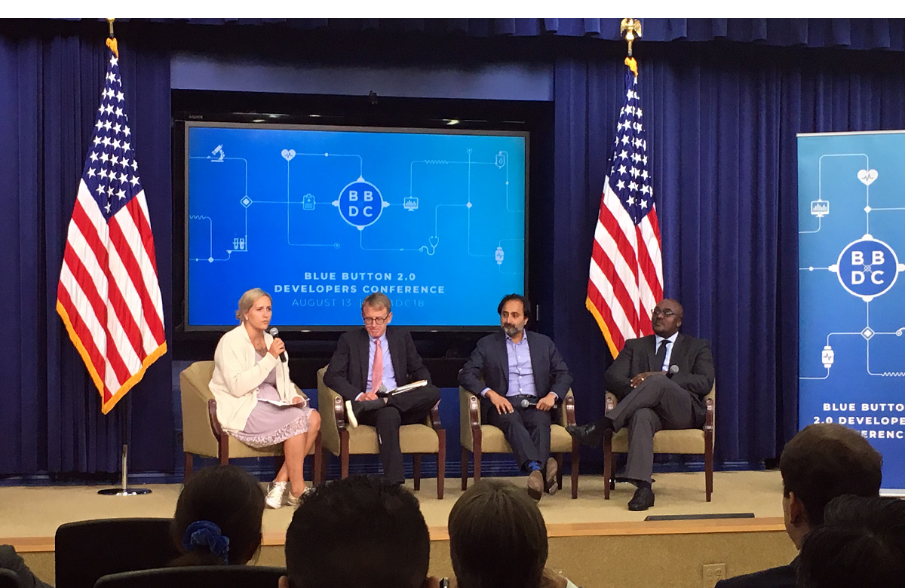

---
# Page template info (DO NOT EDIT)
layout: default
banner_file: banner--people-projects-lg.svg
banner_file_mobile: banner--people-projects-sm.svg
project_page: true

# Carousel (Edit this)
carousel_title: "Modernizing health data access with Medicare APIs"
carousel_summary: "We worked with CMS to build an API that enables beneficiaries with different needs to grant access to developers that can help them monitor for drug conflicts, refill prescriptions, and track progress towards desired healthcare outcomes."
carousel_image_name: project-hhs-blue-button-card.jpg

# Project detail page (Edit this)
title: "Medicare Data API: Blue Button 2.0"
agency: Health and Human Services
permalink: projects/blue-button-2
project_url: https://bluebutton.cms.gov/developers/

# Impact statement (Edit this)
impact_statement:
  - figure: "53"
    unit: "M"
    description: |-
      Americans reliant on Medicare claims

  - figure: 1000
    unit: "+"
    description: |-
      Developers using Blue Button API
---

## The Challenge

Medicare claims data serves as a running health record for 53 million Americans. Locked away, that data was difficult for beneficiaries to access. We wanted to enable Medicare to integrate their health records with third-party applications. To do this, we needed to penetrate the massive bureaucracy of a trillion dollar government agency and create a usable way for beneficiaries to share their data with app developers.

## The Solution

The Center for Medicare & Medicaid Services tapped our team to work alongside them to build Blue Button 2.0, an API that opens Medicare claims data to third-party developers. Blue Button 2.0 enables beneficiaries with different needs to grant access to developers that can help them monitor for drug conflicts, refill prescriptions, and track progress towards desired healthcare outcomes. This reduces the government's burden to build and maintain technically complex software solutions for every possible use case. Major software companies are joining our efforts to drive value-based care outcomes for millions of Americans.

*In August 2018, USDS hosted the Blue Button Developer Conference at the White House where Amazon, Microsoft, Oracle, Google, Salesforce, and IBM all pledged to use the data standard Blue Button 2.0 is built on.*

*One third party company using the Blue Button 2.0 API is [Verily](https://verily.com/), which launched [Project Baseline](https://www.projectbaseline.com/) in 2017 to make it easy and engaging for people to contribute to the map of human health and participate in clinical research.*

## Press

- [An in-depth peek inside the United States Digital Service at HHS](https://www.mobihealthnews.com/content/depth-peek-inside-united-states-digital-service-hhs)
- [CMS launches API for Medicare claims data](https://fcw.com/articles/2018/03/06/cms-blue-button-api.aspx)
- [Government’s most transformational agency: A look inside](https://www.federaltimes.com/it-networks/2018/07/26/governments-most-transformational-agency-a-look-inside/)
- [Tech Giants Pledge Healthcare Interoperability Following White House Conference](https://www.meritalk.com/articles/tech-giants-pledge-healthcare-interoperability-following-white-house-conference/?doing_wp_cron=1551289642.8972449302673339843750)
- [Healthcare app economy is coming: Get ready for the dataquake](https://www.healthcareitnews.com/news/healthcare-app-economy-coming-get-ready-dataquake)
- [USDS in action](https://fcw.com/blogs/lectern/2018/04/kelman-cms-usds.aspx)
- [Healthcare APIs get a new trial run for Medicare claims](https://searchhealthit.techtarget.com/news/252445566/Healthcare-APIs-get-a-new-trial-run-for-Medicare-claims)
- [CMS Administrator Seema Verma calls on payers to release claims data in API format](https://www.healthcareitnews.com/news/cms-administrator-seema-verma-calls-payers-release-claims-data-api-format)
- [CMS to host Blue Button 2.0 conference](https://www.healthcareitnews.com/news/cms-host-blue-button-20-conference)
- [New from the Digital Service team at CMS: Blue Button 2.0 is a Medicare claims data API](https://www.fedscoop.com/embargoed-new-digital-service-team-cms-blue-button-2-0-medicare-claims-data-api/)
- [CMS, USDS innovators on the future of Blue Button 2.0](https://www.healthcareitnews.com/news/cms-usds-innovators-future-blue-button-20)

### DPC

- [White House proposes Data at the Point of Care](https://www.policymed.com/2019/09/12730.html)
- [CMS aims to expand APIs to increase EHR interoperability](https://governmentciomedia.com/cms-aims-expand-apis-increase-ehr-interoperability)
- [Medicare pilot gives physicians access to patients' claims data](https://www.modernhealthcare.com/care-delivery/medicare-pilot-gives-physicians-access-patients-claims-data)
- [What USDS is doing to support patient, provider access to Medicare claims data](https://governmentciomedia.com/what-usds-doing-support-patient-provider-access-medicare-claims-data)
- [Medicaid data made public for the first time](https://www.fedscoop.com/cms-medicaid-data-public/)
- [Medicare data project gains momentum as CMS continues its push for interoperability](https://www.fedscoop.com/health-data-interoperability-cms-va/)
- [A world without prior authorization — How analytics are helping health systems transition to value-based care](https://www.beckershospitalreview.com/payer-issues/a-world-without-prior-authorization-how-analytics-are-helping-health-systems-transition-to-value-based-care.html)
- [Major reformations of the last decade that will shape US healthcare in 2020](https://www.mobihealthnews.com/news/major-reformations-last-decade-will-shape-us-healthcare-2020)
